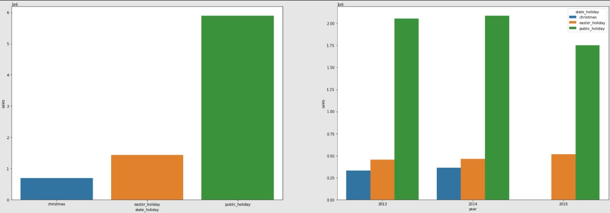

# Rossmann Sales Prediction

## Neste projeto utilizo conceitos da estatística e Machine Learning para construir uma ferramenta de previsão de vendas mais acurada.

#### This project was made by Rodrigo Vieira.

# 1. Business Problem.
- O CEO da empresa deseja iniciar um ciclo de reformas nas lojas da rede. Para isso, precisa da projeção do volume de vendas de todas as 1.115 para as próximas 6 semanas (a partir da data de coleta dos dados) de cada loja a fim de planejar os investimentos.

# 2. Business Assumptions.
- Os registros de vendas partem da mesma data para todas as lojas.
- Dias sem vendas ou de loja fechada serão desconsiderados.
- A coluna *customers* não será utilizada no primeiro ciclo da solução.

# 3. Solution Strategy

My strategy to solve this challenge was:

**Step 01. Data Description:**
Conhecer a dimensão dos dados fornecidos, bem como preencher nulos e realizar análise descritiva de dados numéricos e categóricos.

**Step 02. Feature Engineering:**
Criar novos atributos que agreguem à descrição do fenômeno.

**Step 03. Data Filtering:**
Remover registros e atributos que não agregam para a descrição do fenômeno, reduzindo o dimensionamento da base de dados e facilitando o aprendizado do modelo.

**Step 04. Exploratory Data Analysis:**
Entender o comportamento dos atributos que compoem a base de dados, analisando-os tanto isoladamente quanto em conjunto com outras variáveis. Consequentemente gerando insights e entendendo a relevância de cada atributo na composição do fenômeno.

**Step 05. Data Preparation:**
Utilizar ferramentas estatísticas e matemáticas para ajustar a escala de variáveis numéricas, transformar a natureza de variáveis cíclicas e traduzir variáveis categóricas em numéricas, com o intuito de adequar os dados para uso dos modelos de Machine Learning

**Step 06. Feature Selection:**
Com auxílio do algoritmo Boruta, selecionar o menor número de atributos possível para maximizar o aprendizado do modelo de Machine Learning

**Step 07. Machine Learning Modelling:**
Testar o poder preditivo de alguns modelos de Machine Learning (Linear Regression, Linear Regression Regularized, Random Forest e XGBoost), tendo como baseline o modelo de média aritmética.

**Step 08. Hyperparameter Fine Tunning:**
Utilizar a técnica de Random Search para encontrar o conjunto de hiperparâmetros que maximiza o aprendizado do modelo de Machine Learning escolhido na etapa anterior.

**Step 09. Convert Model Performance to Business Values:**
Traduzir as métricas de performance do modelo para o time de negócio, utilizando MAPE e MAE para projetar o retorno financeiro.

**Step 10. Deploy Model to Production:**
Construir uma API para disponibilizar o acesso à previsão de vendas a partir do smartphone, utilizando um bot no aplicativo de mensagens Telegram.

# 4. Top 3 Data Insights

**Hypothesis 01:** Lojas com maior sortimento deveriam vender mais.

**False.** Lojas com MAIOR SORTIMENTO não tem vendas acima das demais.

**Hypothesis 02:** Lojas com competidores mais próximos deveriam vender menos.

**False.** Lojas com COMPETIDORES MAIS PRÓXIMOS tem vendas acima das demais.

**Hypothesis 03:** Lojas deveriam vender mais depois do dia 10 de cada mês.

**True.** Lojas vendem MAIS depois do DIA 10 de cada mês.

# 5. Machine Learning Model Applied
| Model Name | Execution time | MAE | MAPE | RMSE |
| --- | --- | --- | --- | --- |
| Baseline (Average Model) | 50 ms | 1354.800353 | 0.2064 | 1835.135542 |
| XGBoost | 38 s | 852.40766 | 0.124934 | 1243.582105 |
| Random Forest | 4 m | 691.770593 | 0.100456 | 1032.315079 |
| XGBoost (tunned) | 2.6 s | 686.352512 | 0.100866 | 1000.999707 |

# 6. Machine Learning Modelo Performance

# 7. Business Results
| Possível cenário | Vendas nas próximas 6 semanas |
|   ---   |     ---      |
| Previsão | 284.570.368,00 |
| Pior cenário | 283.801.332,48 |
| Melhor cenário | 285.339.359,75 |

# 8. Conclusions
- A XGBoost se mostrou a melhor escolha para este projeto de previsão. Apesar de apresentar uma acurácia ligeiramente menor do que a Random Forest na fase de testes, a XGBoost performa melhor com menos recursos.

# 9. Lessons Learned
- A principal lição neste projeto foi como decidir qual o melhor algoritmo de Machine Learning para atender à demanda do cliente. Neste caso, apesar de o algoritmo Random Forest apresentar melhores números nas métricas de performance, ele exige muitos recursos físicos para operar. Neste cenário, o retorno financeiro do modelo de previsão poderia ser anulado pelo alto investimento necessário para implementação. Apesar de ter números de performance ligeiramente abaixo do Random Forest, o XGBoost exige menos recursos entregando a redução de custos esperada sem comprometer a performance da estrutura que a empresa já possui.

# 10. Next Steps to Improve
- Criar um modelo de previsão de número de clientes por dia para utilizar essa variável no modelo de previsão de vendas, aumentando a acurácia do modelo.

# All Rights Reserved - Comunidade DS 2022
